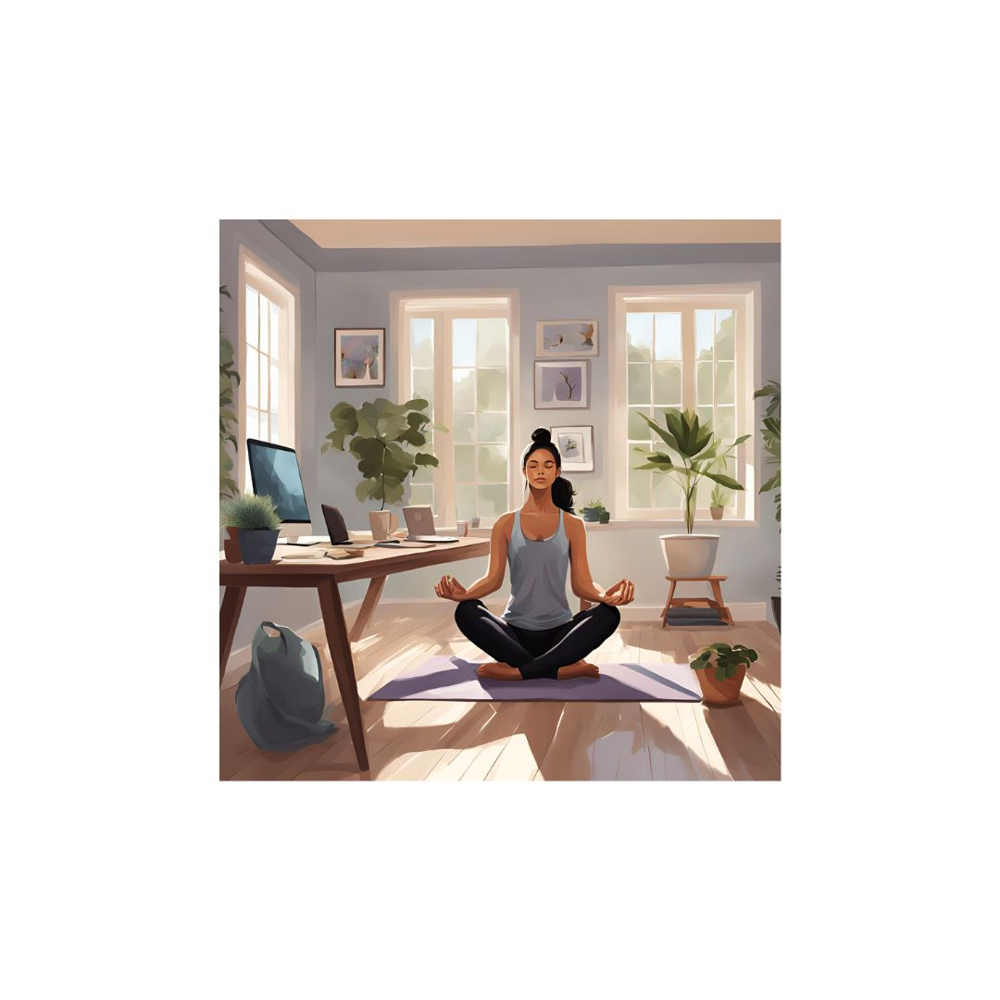

    preview do podcast

    <audio src="output/Podcast Final.MP3" controls title="Podcast Final"></audio>

# Projeto Podcast Gerado por IA

Projeto com o objetivo de gerar um podcast utilizando ferramentas de IA através de prompts mais trabalhado.

Utilizei uma esteira de prompts para gerar cada etapa do processo criativo.

## 💻 Tecnologias utilizadas no projeto

- [ChatGPT](https://chat.openai.com/) 
- [Canvas](https://https://www.canva.com/)
- [ElevenLabs](https://beta.elevenlabs.io/)
- [Capcut](https://www.capcut.com/pt-br/)

## ✨ Como foi feito?

- Roteiro gerado via ChatGPT
- Áudio gerado no ElevenLabs
- Canvas para gerar a capa
- Capcut para tratar aúdio e adicionar sons de fundo

## 🛠️ Execução

- Roteiro gerado via ChatGPT:

Prompt: você é um roteirista de poadcast e vamos criar um poadcast com dicas de exercícios de yoga, relaxamento e saúde para quem trabalha em home office, para o público bancário, que seja divertido

o formato do roteiro deve ser:

[INTRODUÇÃO]

[DICA 1]

[DICA 2]

[DICA 3]

[FINALIZAÇÃO]

no bloco [INTRODUÇÃO] substitua por uma introdução igual a de um youtuber de yoga

no bloco [DICA 1] substitua por uma dica de saúde

no bloco [DICA 2] substitua por uma dica de relaxamento

no bloco [DICA 3] substitua por um exercício de yoga

no bloco [FINALIZAÇÃO] substitua por uma despedida zen com o final "Eu sou sua mentora zen e te espero para novas respirações"

use termos simples e divertidos

o poadcast deve ser curto

{REGRAS NEGATIVAS}

não use a expressão "Namaste"

não ultrapasse cinco minutos de duração

Resposta:

Roteiro para Podcast: Yoga e Saúde no Home Office – Público Bancário

[INTRODUÇÃO]
"Oi, tudo bem? Seja bem-vindo ao nosso momento de pausa! Eu sou sua mentora zen, e hoje vou te ajudar a encontrar equilíbrio entre boletos, reuniões e aquele relatório que parece infinito. Aqui é o seu espaço de respiro, saúde e um pouquinho de movimento pra quebrar a rotina do home office. Bora começar?"

[DICA 1 – Saúde]
"Primeiro, vamos falar de hidratação. Parece básico, mas a maioria das pessoas esquece de tomar água enquanto trabalha. Que tal usar aquele copo bonito que tá guardado no armário? Coloque ao lado do computador e beba água a cada hora. Ah, e se quiser dar um toque especial, adicione umas fatias de limão ou um galhinho de hortelã pra dar aquele charme!"

[DICA 2 – Relaxamento]
"Agora é hora de relaxar os ombros, porque home office sempre acaba transformando a gente em estátua! Solte o mouse por um minutinho. Feche os olhos, inspire profundamente pelo nariz e solte o ar pela boca, como se estivesse soprando pra apagar uma vela. Faça isso três vezes e perceba como seu corpo fica mais leve. É o tipo de reset rápido que te salva depois daquela reunião tensa!"

[DICA 3 – Yoga]
"Vamos para um exercício simples de yoga, perfeito pra quem tá sentado o dia todo. Chama-se 'Torção Sentada'. Sente-se com as costas eretas, plante os pés no chão e coloque a mão direita sobre o joelho esquerdo. A mão esquerda vai pra trás, apoiando no encosto da cadeira. Agora, vire o tronco devagar para a esquerda, como se quisesse olhar pra trás. Segure a posição por alguns segundos, respirando fundo. Depois, troque o lado. Essa torção ajuda a soltar as tensões na coluna e melhora a circulação. Tá aprovado, hein?"

[FINALIZAÇÃO]
"Por hoje é só, mas lembre-se: cada pausa é um presente pra sua mente e pro seu corpo. Cuide de você como você cuida das suas metas e planilhas. Eu sou sua mentora zen e te espero para novas respirações. Até a próxima!"

- Canvas para gerar capas:

Prompt: crie uma imagem de uma pessoa fazendo yoga no seu intervalo, trabalhando de home office

- Capcut para tratar aúdio e adicionar sons de fundo

Música: Piano. Lofi. Calm Down. Break. Park

Efeito: A relaxing environmetal sound of birds singing in the forest
